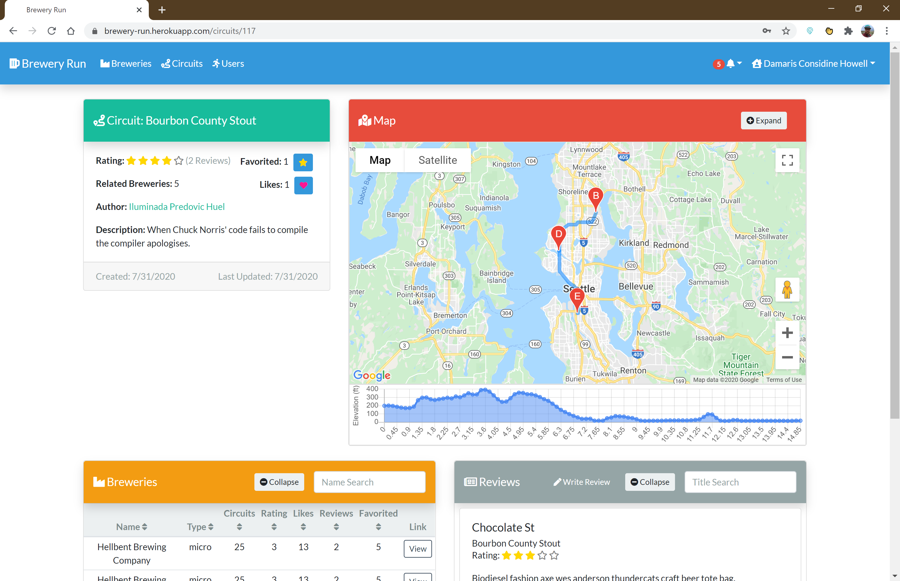
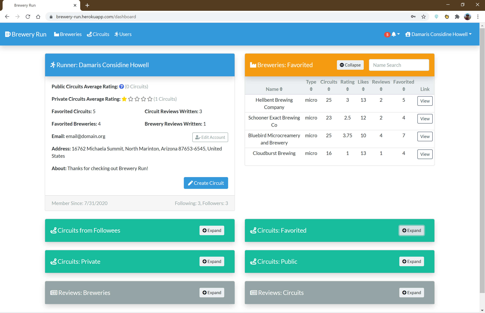

# Brewery Run
Brewery Run is website that helps runners remain calorie neutral during those long runs by planning out routes with stops at your local breweries. Users can find created by the Brewery Run community via a name search or sort the circuits by rating, likes, favorites, etc. Circuit mapping, directions, and elevation maping is provided via the Google Maps API. A user can also create an accout which will grant them additional functionality such as the ability to follow users, write reviews, and create circuits. Each user also receives a customized dashboard which gathers their favorite circuits as well as those from users they are following, into a single page.

**Note:** This this served as my capstone project for my 2020 Flatiron School Software engineering course and now serves as a personal size project. Due to this some features might be disabled since features supported by paid APIs such as Google Maps can quickly reach the free use limit.

The remainder of this README.md will discuss the frontend exclusivley. The backend repository can be found [here](https://github.com/mathewpwheatley/brewery-run-backend).

## Technology Leveraged
- React (Bootstrapped via [Create React App](https://github.com/facebook/create-react-app))
- Redux with Thunk
- Google Maps JavaScript API
- Bootstrap/Bootswatch
- Font Awesome

## Features
- Browse/sort Breweries and view them on a map
- Browse Circuits and view their route as well as elevation on a map
- Brewery and circuit reviews
- Create, edit, delete user account
- Like and favorite circuits & breweries
- Write reviews/rate breweries and reviews
- Follow other users
- Get circuits recommended
- Author circuits

## Screenshots
- Welcome Page

- Sample Circuit

- Sample User Dashboard

## Installation
The user interface for Brewery Run is hosted on Heroku therefore you can access it directly from your browser at https://brewery-run.herokuapp.com. You will not have access to directly edit the frontend interface from the website.

If you instead wanted to manipulate the frontend you must install it locally via the following steps:
1. Assuming you are familiar with Git: Clone or fork/clone the [frontend](https://github.com/mathewpwheatley/brewery-run-frontend).
2. On your local machine, from the remote git directory, run the following commands:
  1. "npm install" to install all required javascript libraries.
  2. Update the endpoint variable "baseURL" to point to your backend database in "./src/actions/endPoints.js". (Instructions for installing the backend can be found [here](https://github.com/mathewpwheatley/brewery-run-backend))
  3. The Google Maps Javascript API requires an key which you can obtain from [here](https://developers.google.com/maps/documentation/javascript/get-api-key).
  4. Create file "./.env" and add Google Maps Javascript API as variable "REACT_APP_GOOGLE_MAP_API=YOUR_KEY_HERE".
  5. "npm start" to start the frontend at default port (localhost:3000).

## Contributing
Contributions are welcome, submit a pull request!

## Authors
* **Mathew Wheatley** - [GitHub](https://github.com/mathewpwheatley)

## License
This project is licensed under the [GNU GPL](https://www.gnu.org/licenses/gpl-3.0.en.html)

